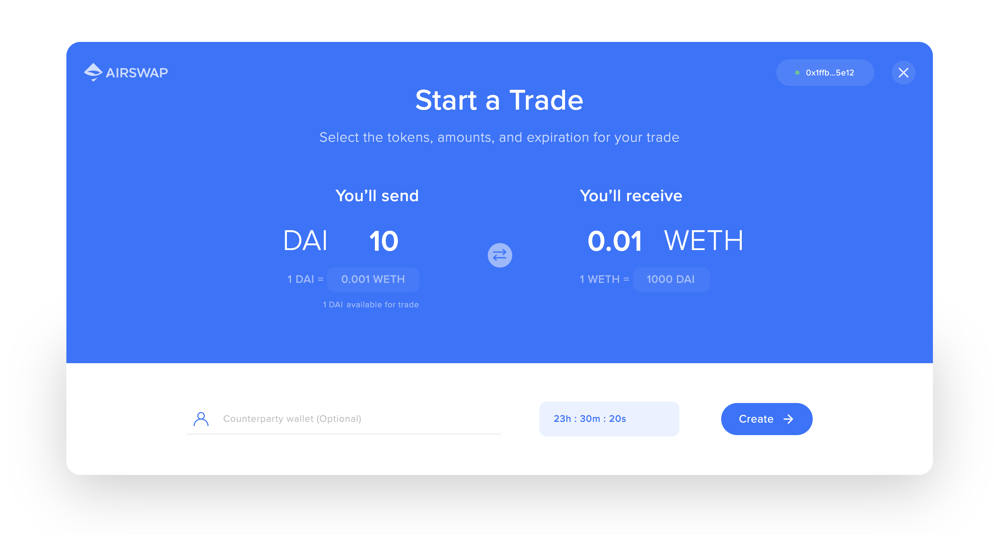

# Trader Widget


The AirSwap Trader Widget is an embeddable, HTML+JavaScript element that can be dropped into any webpage to share and settle over-the-counter trades with no counterparty risk, no deposits, and no fees.

!> Pop-up blockers can prevent the AirSwap Trader Widget from loading properly.

### Usage {docsify-ignore}
#### Setup
Add this to your index.html or respective file to load the widget script.

```html
<head>
    <script src="https://cdn.airswap.io/airswap-trader.js"></script>
</head>
```

#### Creating an empty order builder
Add the following code to where you want to open the widget. The `onCreate` callback function is triggered once the user successfully creates an order. The [order details](#order-ordertype-object-optional), [signature](#signature-signaturetype-object-optional) and [cid](#cid-string-optional) (ipfs hash) are passed as arguments.

```js
window.AirSwapTrader.render(
  {
    onCreate: (order, signature, cid) => {
      console.log('Order created!')
    },
    onClose: (transactionHash) => {
      console.log('Widget closed')
    },
  },
  'body',
)
```
<button class="open-widget" id="open-trader-widget-1" onClick="(function() {
  const button = document.getElementById('open-trader-widget-1');
  button.disabled = true;
  window.AirSwapTrader.render(
    {
      onCreate: (order, signature, cid) => {
        console.log('Order Created!');
      },
      onClose: () => {
        console.log('Widget Closed');
        button.disabled = false;
      },
    },
    'body',
  )
})()">Demo</button>

Hurray! You will now see an empty order builder.


#### Pre-filling values in the order builder
In many cases, you would want to set a desired token and amount. To do so, you can add an order object to the widget options. Passing a value in the object will lock the corresponding field in the widget, preventing the user from changing the value.
```js
window.AirSwapTrader.render(
  {
    order: {
      makerToken: '0x89d24a6b4ccb1b6faa2625fe562bdd9a23260359', // DAI
      makerParam: '10000000000000000000', // Atomic value for 10 DAI
      takerToken: '0xc02aaa39b223fe8d0a0e5c4f27ead9083c756cc2', // WETH
      takerParam: '10000000000000000', // Atomic value for 0.01 WETH
      expiry: 1707026510, // Expiration date in seconds
    },
    onCreate: (order, signature, cid) => {
      console.log('Order created!')
    },
    onClose: (transactionHash) => {
      console.log('Widget closed')
    },
  },
  'body',
)
```
Now, you will see that the token and amount for the taker and maker has been set and locked. Click the button below to test it out!

<button class="open-widget" id="open-trader-widget-2" onClick="(function() {
  const button = document.getElementById('open-trader-widget-2');
  button.disabled = true;
  window.AirSwapTrader.render(
    {
      order: {
        makerToken: '0x89d24a6b4ccb1b6faa2625fe562bdd9a23260359', // DAI
        makerParam: '10000000000000000000', // Atomic value for 10 DAI
        takerToken: '0xc02aaa39b223fe8d0a0e5c4f27ead9083c756cc2', // WETH
        takerParam: '10000000000000000', // Atomic value for 0.01 WETH
        expiry: 1707026510, // Expiration date in seconds
      },
      onCreate: (order, signature, cid) => {
        console.log('Order Created!');
      },
      onClose: () => {
        console.log('Widget Closed');
        button.disabled = false;
      },
    },
    'body',
  )
})()">Demo</button>



#### Creating a Taker Flow
To initiate the Taker flow you would need to pass the full order and signature objects. The `onSwap` callback function will be triggered when the taker fills the order and passes the hash of the transaction as an argument.
```js
window.AirSwapTrader.render(
  {
    order: {
      makerToken: '0x89d24a6b4ccb1b6faa2625fe562bdd9a23260359', // DAI
      makerParam: '1000000000000000000', // Atomic value for 1 DAI
      makerWallet: '0xd68bb3350887ed3ee128b5ac4b7d852e24c5d366',
      takerToken: '0xc02aaa39b223fe8d0a0e5c4f27ead9083c756cc2', // WETH
      takerParam: '10000000000000000000', // Atomic value for 10 WETH
      takerWallet: '0x0000000000000000000000000000000000000000', // Public Order
      expiry: 1709574475,
      nonce: 1567014475983
    },
    signature: {
      version: '0x01',
      signer: '0xd68bb3350887ed3ee128b5ac4b7d852e24c5d366',
      r: '0xf28352ca1252b77771d55293f0fd49f97e544ccdf34c88a4821502495aa5dfa8',
      s: '0x42e653d2a8b09adc6a547ae581a09162cb82d0e456d45fae662956b68de1a394',
      v: 28,
    },
    onSwap: (transactionHash) => {
      console.log('Trade complete!')
    },
    onClose: (transactionHash) => {
      console.log('Widget closed')
    },
  },
  'body',
)
```
\
If you have the full signed order details stored in [IPFS](https://ipfs.io), you can use the IPFS hash instead.
```js
window.AirSwapTrader.render(
  {
    cid: 'QmRi5hnoBJPKJ54FnyqyRnzsigpEYLq75pyjuNeMjoEsNf',
    onSwap: (transactionHash) => {
      console.log('Trade complete!')
    },
    onClose: (transactionHash) => {
      console.log('Widget closed')
    },
  },
  'body',
)
```
<button class="open-widget" id="open-trader-widget-2" onClick="(function() {
  const button = document.getElementById('open-trader-widget-2');
  button.disabled = true;
  window.AirSwapTrader.render(
    {
      cid: 'QmRi5hnoBJPKJ54FnyqyRnzsigpEYLq75pyjuNeMjoEsNf',
      onSwap: (transactionHash) => {
        console.log('Trade complete!')
      },
      onClose: () => {
        console.log('Widget Closed');
        button.disabled = false;
      },
    },
    'body',
  )
})()">Demo</button>


## Options {docsify-ignore}

#### order `orderType (object)`, `optional`
Provide values to pre-populate the order builder. If any of these parameters are specified, it will lock the value in the widget. When setting a signed order, all values must be set.
```js
order: {
  makerToken: '0x89d24a6b4ccb1b6faa2625fe562bdd9a23260359',
  makerParam: '1000000000000000000',
  makerWallet: '0xd68bb3350887ed3ee128b5ac4b7d852e24c5d366',
  takerToken: '0xc02aaa39b223fe8d0a0e5c4f27ead9083c756cc2',
  takerParam: '10000000000000000',
  takerWallet: '0x0000000000000000000000000000000000000000',
  expiry: 1567024230,
  nonce: 1566932032583
}
```
| Type | Key | Description |
| ----------- | ----------- | ----------- |
| string | `makerToken` | `optional` - The address of the token the party sends. Defaults to DAI. |
| string | `makerParam` | `optional` - The atomic amount of an ERC-20 token or the ID of an ERC-721 token to send. |
| string | `makerWallet` | `optional` - The address of the maker Ethereum account. This value is only used when you have a signed order for the user to take. |
| string | `takerToken` | `optional` - The address of the token the party receives. Defaults to ETH. |
| string | `takerParam` | `optional` - The atomic amount of an ERC-20 token or the ID of an ERC-721 token to receive. |
| string | `takerWallet` | `optional` - The address of the taker Ethereum account. If not provided, the order will be public for anyone to take. |
| int | `expiry` | `optional` - The expiry in **seconds** since unix epoch. |
| string | `nonce` | `optional` - A numeric parameter of every Order that is unique to its Maker. Only used when providing a signed order. |

---
#### signature `signatureType (object)`, `optional`
The [ECDSA](https://hackernoon.com/a-closer-look-at-ethereum-signatures-5784c14abecc) signature of the order.
```js
signature: {
  version: '0x01',
  signer: '0x1ffb1788e56a755a74d3b63a787b09b65ca35e12',
  r: '0xec5aac45d8d9fb9f1b32206db8ca5745bef0ff6cca4e10f96891712932674144',
  s: '0x74b363b16641a9cf51c8cad2e3b26bfcaec825b32122aeb41dce3db24ad90ec4',
  v: 28,
}
```
| Type | Key | Description |
| ----------- | ----------- | ----------- |
| string | `version` | `required` - The signing method used. |
| string | `signer` | `required` - The address of the signer Ethereum account. |
| string | `r` | `required` - The `r` value of an ECDSA signature. |
| string | `s` | `required` - The `s` value of an ECDSA signature. |
| number | `v` | `required` - The `v` value of an ECDSA signature. |

---
#### cid `string`, `optional`
[IPFS](https://ipfs.io) hash for the order. If provided, the widget will fetch the order details from IPFS and display a take order screen.

---
#### onCreate `Function`, `optional`
Callback function triggered on creation of a trade. Passes the order, signature, and cid to the function as arguments.
```js
function onCreate(order, signature, cid) {
    console.log('Order Created!');
    ...
}
```
| Type | Parameter | Description |
| ----------- | ----------- | ----------- |
| object | `order` | The [order details](#order-ordertype-object-optional). |
| object | `signature` | The [order signature](#signature-signaturetype-object-optional). |
| string | `cid` | The [IPFS hash](#cid-string-optional) of the order. |

---
#### onSwap `Function`, `optional`
Callback function triggered on a successful trade. Passes the transaction hash of the fill event as an argument.
```js
function onSwap(transactionHash) {
    console.log('Trade Completed!');
    ...
}
```
| Type | Parameter | Description |
| ----------- | ----------- | ----------- |
| `transactionHash` | `string` | Hash of the swap transaction. Can be used on blockchain explorers like [Etherscan](https://etherscan.io/) to view transaction details. |

---
#### onCancel `Function`, `optional`
Callback function triggered when a trade is canceled. Passes the transaction hash of the cancellation event as an argument.
```js
function onCancel(transactionHash) {
    console.log('Trade Cancelled!');
    ...
}
```
| Type | Parameter | Description |
| ----------- | ----------- | ----------- |
| `transactionHash` | `string` | Hash of the cancelation transaction. Can be used on blockchain explorers like [Etherscan](https://etherscan.io/) to view transaction details. |

---
#### onClose `Function`, `required`
Callback function triggered when the user closes the widget. No arguments.

```js
function onClose() {
    console.log('Widget closed');
}
```
